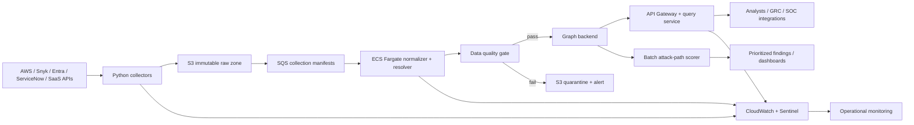

# 建立企業安全知識圖譜：可執行專案計畫

狀態：Draft v0.1
適用環境：美國金融業、AWS 多帳號、AppSec／Cloud Security、小型資安團隊
主要讀者：Security Architecture、AppSec、Cloud Security、IAM、GRC、Platform Engineering

## 1. Executive summary

本專案要建立一個「可提出跨系統問題、答案可追溯到原始證據」的企業安全知識圖譜。它不是把 CMDB 換成比較潮的圓圈箭頭，也不是先做一個會發光的 dashboard；核心價值是把目前散落在 AWS、Snyk、Entra ID、ServiceNow、Sentinel、Snowflake 與各種 SaaS 的資產、身分、資料、弱點、控制、責任人連起來，回答單一工具回答不了的問題。

第一條端到端薄切聚焦：

> 哪些 Internet-exposed production workloads 存在高風險 finding，而且可經由高權限身分一路觸達 PCI／critical data？答案的每一條邊是否有來源、觀測時間與 collector version？

MVP 不追求「企業所有資料一次到齊」。先接 AWS、Snyk、Entra ID，再補 ServiceNow ownership／criticality。沒有 owner、environment、evidence freshness 的資料，不得裝成熟地進 production risk ranking。Dashboard 綠不綠不是重點，能不能對一條 attack path 逐邊驗證才是。

## 2. 問題定義與設計原則

### 2.1 現況問題

- AWS 多帳號資產、Snyk findings、Entra 群組與 ServiceNow application ownership 缺乏一致 ID。
- Vulnerability severity 沒有結合暴露面、business criticality、身分可達性與 compensating controls。
- Joiner／Mover／Leaver、AWS role、SaaS RBAC 與 service principal 分散，間接權限難以說明。
- PCI、NYDFS、GLBA、SOX 證據多半以報表／ticket 方式存在，難以回答控制覆蓋與最新狀態。
- Splunk 到 Sentinel 遷移期間，偵測、事件與資產脈絡可能斷裂。
- 現有 Python 報表整合適合逐步演化成 collectors，但需要統一契約、checkpoint、品質閘門與 lineage。

### 2.2 設計原則

1. **Evidence first**：沒有來源與時間的關係，不算已知事實，只能算 hypothesis。
2. **Read-only first**：MVP 不回寫來源系統、不自動改權限、不自動關 finding。
3. **Incremental slice**：用一條可驗證 use case 驗證模型，不做一次性 enterprise ontology 大爆炸。
4. **Identity is a first-class graph**：人、群組、service principal、AWS role、workload identity 均為獨立實體。
5. **No secret values**：圖譜只存 secret reference、owner、rotation metadata、usage edge，絕不存秘密內容。
6. **Time matters**：observed_at、valid_from、valid_to、collected_at 與 freshness 都必須能查。
7. **Explainable risk**：風險排名可拆出每個 factor、路徑與控制折減，禁止黑箱 magic score。
8. **Policy-as-code**：schema、source config、risk weights、access policy 與 saved queries 均進版本控制。

## 3. 目標與非目標

### 3.1 目標

- 建立跨 AWS account、repo、workload、identity、data store、finding、control、owner 的 canonical model。
- 在 24 小時 freshness 內產出可重現的 production attack paths。
- 讓 analyst 從答案回到每一個 source record，包含 collector version 與觀測時間。
- 支援 PCI／NYDFS／GLBA／SOX 控制覆蓋、例外與證據查詢。
- 建立 adapter contract，讓現有 Python 報表與未來 SaaS connector 可持續擴充。
- 將資料品質、schema drift、reconciliation failure 變成可監控事件。
- 在 production 建立 least privilege、row/property-level masking、完整 audit trail 與 separation of duties。

### 3.2 非目標

- 不取代 ServiceNow CMDB、Snyk、Sentinel、Entra ID、AWS Config 或 GRC system of record。
- MVP 不做自動 remediation、帳號停權、security group 修改或 ticket closure。
- 不將所有 log/event 全量塞進 graph；高容量 telemetry 留在 Sentinel／data lake，只保留聚合與 reference。
- 不把原始 PII、HR 敏感欄位、secret value、完整 source code、email/message content 放進圖譜。
- 不宣稱 graph score 等同 breach probability 或財務損失預測。
- 不在 MVP 建即時 streaming；先以 hourly／daily incremental batch 滿足 use case。
- 不先解決全企業 entity resolution。MVP 只處理明確 natural keys 與人工管理 mapping。

## 4. 核心使用案例

| 優先 | 使用案例 | 主要角色 | 可採取行動 | 成功指標 |
|---|---|---|---|---|
| P0 | Internet-facing workload → vulnerability → PCI data attack path | AppSec／Cloud Security | 優先修最短且可利用路徑 | Top 20 path 均可逐邊驗證 |
| P0 | Privileged identity → AWS role／SaaS admin → crown jewel | IAM／Cloud Security | 移除過度權限、改 JIT | 找出 dormant／indirect admin access |
| P0 | Finding → repo → pipeline → deployed workload → owner | AppSec | 正確派工與 SLA | ≥95% MVP findings 有 owner |
| P1 | Terminated／moved worker 的 residual access | IAM／Audit | Revoke／review | 高風險 residual access 在 24h 內可見 |
| P1 | Control → asset／identity → evidence → framework requirement | GRC／Audit | 證據抽樣與缺口追蹤 | 稽核抽樣可一鍵回溯來源 |
| P1 | Secret → workload／pipeline → owner → rotation status | AppSec／Platform | Rotation／移除 orphan secret | 不儲存 secret value 仍可查使用面 |
| P1 | Sentinel incident → identity／asset → known weakness | SOC | 快速 enrich 與定界 | enrichment p95 < 2 秒 |
| P2 | Snowflake role／PrivateLink／data object reachability | Data Security | 收斂網路與 role path | critical table 非預期路徑可列舉 |
| P2 | SaaS posture → control → business owner | SaaS Security | 對 Adaptive Shield finding 派工 | owner coverage ≥90% |
| P3 | Power Platform／Salesforce／UiPath shadow automation | Governance | 找出 orphan owner 與 risky connector | inventory coverage 可量化 |

## 5. 圖譜資料模型

機器可讀契約在 `schema/graph-model.yaml`。以下是概念層摘要。

### 5.1 核心實體

| Domain | 實體 | Canonical natural key 範例 | 關鍵欄位 |
|---|---|---|---|
| Enterprise | Organization, OrganizationalUnit, BusinessService, Application | `servicenow:sys_id` | owner, criticality, lifecycle |
| AWS／Runtime | AwsAccount, CloudResource, Workload, Pipeline | account ID, ARN, cluster/namespace/name | environment, region, exposure |
| SDLC | Repository, Component, Finding | provider/org/repo, purl, source issue ID | branch, version, severity, status |
| Identity | Identity, Group, Role, Entitlement | tenant/object ID, role ARN | kind, privilege tier, status |
| Data／Secret | DataStore, Secret | platform-scoped ID, secret ARN/reference | classification, residency, rotation metadata |
| Governance | Control, Exception, Owner | framework/control ID, exception ID | status, expiry, approver |
| Detection | Incident, Alert/Detection reference | Sentinel incident ID | severity, state, time window |

### 5.2 核心關係

- 結構：`CONTAINS`、`HOSTS`、`SUPPORTS`、`OWNED_BY`
- SDLC：`DEPLOYS_TO`、`DEPENDS_ON`、`AFFECTS`
- Identity：`MEMBER_OF`、`ASSUMES`、`GRANTS`、`CAN_ACCESS`、`CAN_ADMINISTER`、`RUNS_AS`
- Data／Secrets：`STORES_DATA_IN`、`USES_SECRET`
- Governance：`MITIGATES`、`EVIDENCES`、`EXCEPTS`
- Detection：`OBSERVED_IN`

### 5.3 Identity resolution

Canonical ID 由 `entity_type + source-scoped natural key` 做 deterministic hash。不同來源是否為同一實體，不直接靠名稱猜測；使用 `IDENTICAL_TO`／mapping table 表達已核准對應。

Resolution 次序：

1. 強 ID：AWS ARN/account ID、Entra tenant/object ID、ServiceNow sys_id、Snyk issue/project ID。
2. 核准 mapping：repo ↔ application、AWS account ↔ business service。
3. 規則候選：email、hostname、tag、deployment metadata，只產生 match candidate。
4. 人工或 authoritative source 核准後才 merge。

禁止僅靠 display name 自動 merge；`prod-admin` 這種名字在企業裡通常比 Starbucks 還多。

### 5.4 Temporal model

每個 entity/relationship 至少保留：

- `observed_at`：來源認為資料有效的時間。
- `collected_at`：collector 取得資料的時間。
- `valid_from`／`valid_to`：權限、ownership、exception 的有效區間（來源支援時）。
- `first_seen_at`／`last_seen_at`：平台推導的生命週期。
- `is_current`：目前快照是否仍存在。

刪除採 tombstone，不直接物理刪除；避免回答「昨天誰還有權限」時只剩集體失憶。

## 6. 資料來源與 ingestion 優先順序

### 6.1 分層優先順序

| Wave | 來源 | 取得內容 | 理由／依賴 |
|---|---|---|---|
| 0 | 現有 Python 報表、人工 mapping | 已知 account/repo/app/owner 關聯 | 快速建立 baseline 與發現 ID 問題 |
| 1 | AWS Organizations、Config、Security Hub | account、resource、exposure、finding | 資產與 cloud finding 骨架 |
| 1 | Snyk Enterprise | org/project/repo/component/finding | AppSec 主問題 |
| 1 | Entra ID | user/group/service principal/app role | 身分可達性主問題 |
| 2 | ServiceNow CMDB／GRC | app、service、owner、criticality、exception | 風險 business context |
| 2 | Sentinel（含 Splunk mapping） | incident/detection reference | SOC enrichment 與遷移連續性 |
| 2 | Snowflake | role grant、database/schema、network policy | critical data path |
| 3 | Adaptive Shield、M365、Intune、Workday | SaaS posture、device、worker status | JML、posture、owner enrichment |
| 3 | Kubernetes、container registry | workload、image、service account、network exposure | runtime attack path |
| 4 | Power Platform、Salesforce、UiPath | environment、flow/bot、connector、owner | citizen development governance |

### 6.2 Collector contract

每個 adapter 必須：

- read-only，使用專屬 workload identity／assume role。
- 支援 checkpoint／delta token；無 delta 時保留 full snapshot hash。
- 產出 source-neutral JSONL，再進 canonical normalizer。
- 保存 source record ID、request window、API version、collector version。
- 對 rate limit 使用 bounded exponential backoff，不得無限重試。
- 將 schema error、auth failure、partial page、late data 分類送入 quarantine。
- 產出 collection manifest：record count、page count、checksum、start/end、status。

### 6.3 Reconciliation

每輪 ingestion 要做：

1. Extract 至 immutable raw zone。
2. Validate source envelope 與 checksum。
3. Normalize 至 canonical staging。
4. Resolve IDs／relationships。
5. 執行 schema、referential integrity、freshness、volume drift 檢查。
6. Merge current graph 並寫 history/tombstone。
7. 比對來源總量；超過門檻則停止 publish，不把「API 少回一頁」當成全公司資產突然消失。

## 7. AWS／Python 技術架構



### 7.1 AWS components

- **EventBridge Scheduler**：依 source freshness 執行 collectors。
- **ECS Fargate**：長時間／大量 pagination collectors 與 normalizer；比 Lambda timeout 更不容易踩雷。
- **Lambda**：小型 webhook、manifest validation、輕量 API handler。
- **S3**：raw、canonical snapshot、quarantine、manifest；Object Lock／versioning 依證據需求啟用。
- **SQS + DLQ**：source job decoupling、重試與 poison message 隔離。
- **Step Functions**：只在跨多步驟且需要可視化重試／人工核准時使用，避免每件事都畫成 state machine。
- **Secrets Manager**：API token／key-pair reference；優先使用 workload identity／assume role。
- **KMS**：raw、graph、logs、backup 分離 key policy。
- **CloudWatch + Sentinel**：pipeline health、auth anomaly、data-quality failure 與 admin action。
- **PrivateLink／VPC endpoints**：S3、SQS、Secrets、graph endpoint 盡量不走 public Internet。

### 7.2 Multi-account pattern

- Security tooling account 執行 collectors。
- 各 workload account 建立 `SecurityGraphReadOnly` role，external ID／organization condition／session tag 限制。
- SCP 不為圖譜開過度例外；collector policy 只允許明列的 list/get/describe。
- Account onboarding 以 CloudFormation StackSets 或 Terraform module 管理。
- CloudTrail 記錄所有 assume-role 與 graph administrative action。
- Production 與 non-production 使用不同 graph、KMS key、credentials 與 release gate。

### 7.3 Python code boundaries

```text
adapters -> raw envelopes -> normalizer -> resolver -> quality gates
         -> backend writer -> query service -> risk/path jobs
```

- `adapters/` 不知道 graph database 細節。
- `normalizer` 只負責 canonical contract，不呼叫外部 API。
- `resolver` 管理 cross-source mapping 與 merge decision。
- `backends/` 封裝 Neo4j／Neptune／AGE query differences。
- `quality/` 輸出 machine-readable test results。
- `risk/` 只讀版本化 config 與 path facts，不偷偷改 finding severity。
- 所有 collector 支援 replay 固定 raw fixture，CI 不依賴真實 SaaS。

## 8. 儲存方案比較與建議

| 面向 | Neo4j | Amazon Neptune | PostgreSQL + Apache AGE |
|---|---|---|---|
| Query／開發體驗 | Cypher 成熟，圖演算法與工具完整 | 支援 openCypher／Gremlin／SPARQL，但有相容差異 | Cypher-like + SQL，可與 relational data 靠近 |
| Managed operations | Aura 或自管 | AWS managed、Multi-AZ、IAM/VPC 整合佳 | 通常需自管 AGE；不能假設 RDS PostgreSQL 支援任意 extension |
| AWS 金融業治理 | 可做，但需額外 vendor／network 評估 | 最自然，CloudTrail/KMS/VPC/backup 整合 | 自管 patch/HA/backup 是實際負擔 |
| Graph algorithms | 最強、GDS 生態成熟 | 基本 traversal 足夠；複雜 analytics 可另做 | 生態與 tooling 較弱 |
| SQL／報表 | 需同步或 connector | 需額外 serving layer | 原生優勢 |
| Lock-in／可攜性 | Cypher 與 vendor features | AWS API/query semantics | PostgreSQL 基礎較開放，但 AGE 本身仍有版本限制 |
| 小團隊 time-to-value | 高 | 中 | local demo 高，production ops 低 |
| 成本輪廓 | license／Aura 費用需評估 | instance + I/O，低流量也有底價 | software 低，營運人力可能最高 |

### 8.1 建議決策

1. **Phase 0 local**：目前骨架以 canonical JSON artifact 執行，零外部依賴，先驗證模型與資料品質。
2. **MVP benchmark**：以相同 1M nodes／5–10M edges synthetic dataset，比較 Neptune openCypher 與 Neo4j。
3. **Production 預設候選：Neptune**：若 traversal p95、openCypher coverage 與成本達標，優先利用 AWS managed controls，降低小團隊營運負擔。
4. **Neo4j 選擇條件**：若 GDS／path analytics、Cypher tooling、analyst productivity 的價值明顯超過 vendor與治理成本。
5. **AGE 選擇條件**：團隊已有可靠 PostgreSQL extension 自管平台，而且 SQL/graph co-location 是硬需求。否則別把「免 license」誤會成「免成本」。

### 8.2 Benchmark gate

- 1M nodes、5M／10M edges load time 與儲存成本。
- 代表性 10 條 query：1-hop lookup、4–8 hop path、fan-out、temporal filter、top-N risk。
- p50／p95／p99 latency、timeout rate、concurrent readers。
- Incremental upsert、tombstone、backup/restore、regional failover。
- Query feature gaps、driver maturity、IaC support、audit logging。
- 三年 TCO：service、license、engineering operations、DR exercise。

## 9. 身分與權限模型

### 9.1 Human and workload access

- Entra ID 作為 workforce IdP，使用 group-to-role mapping。
- Production human access 需 MFA、conditional access、PIM/JIT 與 time-bound approval。
- Collector 每個 source 使用獨立 workload identity；不得共用「graph-super-admin」token。
- Query API 接收 caller identity 與 purpose，執行 RBAC/ABAC policy。
- App owner 只能看到 owned scope；auditor 可讀 evidence 但不可修改；analyst 預設看不到 HR PII。
- Break-glass 帳號離線保管、使用即告警、每季測試。

### 9.2 Separation of duties

- Collector operator 不可自行變更 canonical schema 後直接 publish。
- Graph admin 不可讀 source credentials。
- Risk model author 的變更需獨立 reviewer 與 backtest。
- Exception approver 不可同時是 exception requester。
- Platform admin 不可接受 business risk。

### 9.3 Sensitive-data handling

- 圖中人員只保存 object ID、必要 display name、employment status class；不保存薪資、住址、完整 HR profile。
- Secret 只保存 ARN／vault reference、rotation date、owner 與 consumer edge。
- Source URI 應使用 opaque reference 或受權 API，不把 bearer token 放在 URL。
- Export 設 row count、TTL、watermark、purpose tag，並記錄 audit event。

## 10. 資料品質與證據鏈

### 10.1 Evidence envelope

每個 entity／relationship 必須具備：

```json
{
  "source_system": "aws-config",
  "source_record_id": "arn-or-opaque-id",
  "source_uri": "optional-authorized-reference",
  "observed_at": "2026-07-10T12:00:00Z",
  "collected_at": "2026-07-10T12:03:22Z",
  "collector_version": "0.1.0"
}
```

Raw object checksum、collection manifest 與 normalization release 另存 S3；圖內只保存 pointer 與必要摘要。

### 10.2 Quality dimensions and gates

| Dimension | MVP gate | Publish behavior |
|---|---:|---|
| Schema validity | 100% canonical records | invalid records quarantine |
| Referential integrity | 0 dangling current edges | fail batch |
| Evidence coverage | 100% nodes/edges | fail batch |
| Freshness | P0 source ≤24h | warn at 12h, block risk publish at 24h |
| Owner coverage | ≥95% P0 findings | publish with explicit unknown-owner queue |
| Criticality coverage | ≥90% prod workloads | exclude unknown from auto-ranking, report gap |
| Source reconciliation | count delta within source-specific band | stop tombstones if abnormal |
| Duplicate rate | <0.5% after approved resolution | quarantine candidates |

### 10.3 Conflicting evidence

- Authoritative-source matrix 決定欄位優先權，例如 employment status 以 Workday 為準、cloud resource state 以 AWS Config 為準。
- 不覆蓋衝突事實；保留 observations，current projection 依政策選擇 winning assertion。
- 回答 API 返回 `confidence`、`freshness_status`、`winning_source` 與 conflict count。
- Analyst 可 dispute；修正走 mapping/policy PR，不直接手改 graph 偷渡真相。

## 11. 風險評分與 attack path

### 11.1 MVP risk model

`config/risk-model.yaml` 與 `src/security_graph/risk.py` 提供透明 baseline：

```text
inherent = 0.25*severity
         + 0.20*exploitability
         + 0.20*exposure
         + 0.25*asset_criticality
         + 0.10*identity_reach

residual = inherent * (1 - 0.60*control_reduction)
score = clamp(residual * 100, 0, 100)
```

每個 factor 正規化為 0–1。Control reduction 必須有 evidence，最大折減 60%；避免只因為某個 control 在簡報上存在，就把 critical finding 洗成 low。

### 11.2 Path semantics

Attack path 只允許 allowlist edge types，並標註：

- **Entry**：Internet-facing endpoint、compromised identity、public repo secret exposure。
- **Traversal**：`CAN_ACCESS`、`ASSUMES`、`GRANTS`、`DEPLOYS_TO`、`DEPENDS_ON`、`USES_SECRET`。
- **Target**：criticality 4–5 workload、PCI data、privileged control plane、high-impact business service。
- **Precondition**：credential possession、network reachability、exploit maturity、MFA/PIM requirement。
- **Mitigation**：有效 control 與 evidence freshness。

### 11.3 Ranking

- 先找 bounded simple paths（預設 max 8 hops），避免 cycle 與 combinatorial explosion。
- 依 entry exposure、finding exploitability、privilege gain、target criticality 加權。
- 同一 root cause 造成的大量相似 path 做 path family deduplication。
- 返回最短 path 之外，也返回 risk-contributing path；最短不一定最危險。
- 每條 path 顯示 stale／conflicting evidence，不把未知當安全。
- Score 變更先在歷史 snapshot backtest，再由 reviewer 核准版本。

## 12. API 與查詢範例

初始 REST contract 在 `examples/openapi.yaml`，Cypher 分析查詢在 `examples/queries.cypher`。

### 12.1 API surface

- `GET /v1/entities/{id}`：取得 entity、evidence summary、freshness。
- `GET /v1/entities/{id}/neighbors?relationship=...&depth=...`：bounded traversal。
- `GET /v1/attack-paths?target_id=...&max_hops=8`：列出已評分 path。
- `GET /v1/findings?owner_id=...&min_score=60`：以 owner／風險查 finding。
- `GET /v1/evidence/{record_id}`：回傳授權後 evidence metadata／source pointer。
- `POST /v1/query-templates/{id}:execute`：執行核准 parameterized query。

Production 不提供任意 anonymous Cypher endpoint。進階 analyst query 經 read replica／query gateway、timeout、row limit、cost guard 與 audit。

### 12.2 Example response

```json
{
  "path_id": "path:example",
  "score": 86.4,
  "score_version": "1",
  "entry": {"id": "cloudresource:example", "reason": "internet_exposed"},
  "target": {"id": "datastore:example", "classification": "pci"},
  "hops": [
    {
      "relationship": "CAN_ACCESS",
      "source_id": "identity:example",
      "target_id": "workload:example",
      "observed_at": "2026-07-10T12:00:00Z",
      "source_system": "entra-id"
    }
  ],
  "freshness_status": "current",
  "conflicts": []
}
```

## 13. 分階段 roadmap

### Phase 0 — Contract and replayable skeleton（第 0–2 週）

- 核准 P0 use case、authoritative-source matrix、data classification。
- 固定 schema v1、evidence envelope、ID strategy、quality gates。
- 建 synthetic fixtures 與現有 Python 報表 replay。
- 執行 canonical JSON demo 與 CI tests。
- 建 threat model、DPIA/privacy review、production access roles 草案。

Exit：樣本端到端成功、0 dangling edges、每筆有 evidence、五位關係人同意 P0 問題定義。

### Phase 1 — MVP thin slice（第 3–8 週）

- AWS Organizations／Config／Security Hub adapter。
- Snyk Enterprise adapter。
- Entra ID group／service principal／role adapter。
- 人工或現有報表提供 app/repo/account/owner mapping。
- 選定並部署 staging graph backend。
- 提供三個 saved queries 與 attack-path batch job。
- CloudWatch metrics、quarantine、DLQ、runbook。

Exit：MVP 驗收標準全數通過，analyst 可對 Top 20 paths 逐邊抽驗。

### Phase 2 — Business context and control evidence（第 9–14 週）

- 接 ServiceNow ownership、criticality、exception。
- 對 PCI／NYDFS／GLBA／SOX 建 control/evidence mapping。
- 建 app-owner scoped view 與 auditor view。
- 建 conflict workflow、owner attestation、expired exception query。
- 執行 storage benchmark 與 production ADR。

Exit：P0 finding owner coverage ≥95%，criticality coverage ≥90%，auditor 完成一次 evidence sampling。

### Phase 3 — Runtime and SOC enrichment（第 15–22 週）

- Kubernetes／registry／workload identity。
- Sentinel incident enrichment；保留 Splunk detection mapping。
- Snowflake role grants、PrivateLink/network policy、critical data objects。
- Near-real-time delta for privileged changes。

Exit：SOC enrichment p95 <2s；privileged change 在 30 分鐘內出現；DR restore exercise 通過。

### Phase 4 — SaaS and citizen development（第 23 週後）

- Adaptive Shield、M365、Intune、Workday JML。
- Power Platform、Salesforce、UiPath inventory 與 ownership。
- Risk model calibration、path family grouping、trend reporting。
- 評估 bounded remediation proposal；任何 write-back 另立 approval 與 kill switch。

## 14. MVP 範圍

### In scope

- 20–50 個 AWS accounts 的 organization/resource baseline。
- Snyk projects、open high/critical findings、repo mapping。
- Entra users/groups/service principals 與 AWS privileged role mapping。
- Production workload、Internet exposure、criticality／owner（可先用核准 mapping）。
- 三類查詢：finding-to-owner、identity-to-critical-asset、entry-to-PCI-data path。
- Hourly AWS/Snyk、4-hourly Entra、daily mapping ingestion。
- Canonical snapshots、evidence pointer、quality report、quarantine。
- Read-only analyst API／saved query、batch risk score。

### Out of scope

- 全量 M365/Workday/Salesforce/Power Platform/UiPath。
- 即時 event stream、全量 Sentinel logs。
- 自動修復、雙向 ticket synchronization。
- Machine-learning entity matching 或 breach prediction。
- 全企業 UI portal；MVP 可用 API、notebook、saved query／簡單報表。

## 15. 驗收標準

### Functional

- 可從 synthetic/raw fixture 重建相同 canonical IDs 與相同 graph snapshot。
- P0 三條查詢均能返回 entity、relationship、evidence、freshness、score version。
- Top 20 attack paths 的每條邊都能追到 source system + record ID + observed time。
- 已知 terminated identity 測試案例能被 residual-access query 找出。
- Expired exception 測試案例能重新進入 remediation queue。

### Data quality

- 100% current nodes/edges 有 evidence。
- 0 dangling current relationships。
- P0 source 在 24 小時 SLO 內，late source 不更新 risk ranking。
- P0 finding owner coverage ≥95%；prod workload criticality coverage ≥90%。
- Reconciliation abnormal 時不產生 mass tombstone。

### Security and compliance

- 圖中不存在 secret values、未核准 PII、source API token。
- Collector permissions 通過 IAM Access Analyzer／人工 least-privilege review。
- 所有 query、export、admin change 具 caller、purpose、time、result-count audit。
- KMS encryption、backup restore、credential rotation、break-glass 測試有證據。
- Threat model 的 critical/high findings 關閉或有核准且未過期 exception。

### Reliability and performance

- 10M-edge benchmark 下 P0 saved queries p95 ≤2s；complex path batch 在 30 分鐘內完成。
- Incremental collection 單一 source 失敗不阻塞其他來源。
- Pipeline 重跑 idempotent，不產生 duplicate entities／edges。
- RPO ≤24h、RTO ≤8h（MVP），且至少完成一次 restore exercise。

### Operability

- 有 source onboarding、schema change、late data、DLQ replay、credential rotation、restore runbooks。
- 每個 alert 有 owner、severity、action；無人處理的 alert 不准假裝叫 monitoring。
- 月度報告含 freshness、coverage、conflict、quarantine、query usage 與 cost。

## 16. 風險與緩解

| 風險 | 影響 | 早期訊號 | 緩解 |
|---|---|---|---|
| Scope 爆炸 | 永遠沒有第一個可用答案 | source 清單一直加、use case 不驗收 | 鎖 P0 thin slice；新增來源需對應使用案例 |
| 錯誤 entity merge | 產生假 attack path／誤派工 | display-name match 比例高 | 強 ID、candidate review、可逆 merge |
| Stale edges | 顯示已不存在的權限 | freshness SLO 違反 | tombstone、late-source gate、顯示 freshness |
| Source API 不完整／rate limit | 資產莫名消失 | page/count delta 異常 | manifest reconciliation、checkpoint、停止 mass delete |
| Graph traversal 爆炸 | query timeout／成本飆升 | high fan-out、無限 depth | edge allowlist、max hops、timeout、precomputed path families |
| Risk score 被當真理 | 錯誤資源排序 | 使用者只看單一數字 | factor breakdown、confidence、backtest、model version |
| 圖譜成為高價值目標 | 權限與拓撲外洩 | bulk export／異常 query | JIT、ABAC、masking、audit、egress control |
| Secret／PII 誤匯入 | Compliance incident | schema 出現敏感欄位 | allowlist schema、DLP scan、quarantine、redaction |
| Tool lock-in | Migration 困難 | vendor-only query 增長 | canonical model、backend interface、portable query subset |
| Production AGE 維運低估 | HA/patch/backup 失敗 | 需要自建 extension cluster | benchmark TCO；預設 managed backend 候選 |
| Owner／criticality 不可信 | 找對洞、派錯人 | unknown/conflict 高 | ServiceNow authority + attestation + coverage KPI |
| Control 宣稱過度 | 風險被錯誤折減 | control 無新鮮 evidence | evidence-required reduction、最大 60% cap |
| Splunk→Sentinel 斷層 | 歷史 detection context 消失 | rule ID 無 mapping | 保存 detection crosswalk、雙跑驗證期 |

## 17. 後續 backlog

### Data and adapters

- AWS IAM Identity Center permission sets、resource policies、Access Analyzer findings。
- EKS namespace/service account/network policy、ECR image digest。
- Snowflake database role、future grants、tag-based classification。
- Adaptive Shield SaaS control mapping 與 vendor finding dedup。
- Workday mover event → Entra group delta correlation。
- ServiceNow exception expiry／risk acceptance evidence。
- Salesforce permission set／connected app、Power Platform connector、UiPath robot credential reference。

### Analytics

- Toxic combination queries（例如 prod write + security logging disable）。
- Blast-radius simulation 與 proposed policy diff。
- Path family clustering、root-cause remediation leverage。
- Control coverage gap heatmap（以 evidence freshness 加權）。
- Historical graph diff：本週新增 privileged paths。
- Score calibration：以 confirmed incident／pen-test paths 做 backtest，但不宣稱因果。

### Platform

- Backend abstraction + Neptune/Neo4j writers。
- OpenTelemetry tracing、source-level cost attribution。
- Data contract compatibility checker 與 schema migration tooling。
- Signed collection manifests、S3 Object Lock、evidence retention policy。
- Query gateway cost estimator、circuit breaker、result cache。
- Blue/green graph publish 與 snapshot rollback。
- Synthetic 1M/10M edge benchmark generator。

### Governance and UX

- Owner attestation inbox 與 dispute workflow。
- Auditor evidence pack export（watermark + TTL）。
- App owner explainable path view。
- Data stewardship RACI、source onboarding checklist。
- Quarterly access review 與 annual threat-model refresh。
- Automated documentation from schema/config。

## 18. 首 30 天執行清單

### Week 1

- 指定 product owner、technical owner、data stewards。
- 核准 P0 question、10 個已知 test cases、data classification。
- 盤點現有 Python 報表 input/output 與 source credentials pattern。
- 完成 threat model 與 source authoritative matrix 初稿。

### Week 2

- 實作 AWS Organizations、Snyk、Entra fixture-based adapters。
- 建 repo/account/app/owner mapping 檔與 review 流程。
- 在 CI 跑 unit、contract、fixture replay、secret scan。
- 對真實但去識別的小樣本做 resolution review。

### Week 3

- 部署 S3 raw/quarantine、SQS/DLQ、EventBridge、ECS staging pipeline。
- 接 staging graph backend，匯入第一批 production-like data。
- 實作三個 P0 saved queries 與 risk/path batch。
- 加 freshness、count drift、dangling edge、owner coverage metrics。

### Week 4

- AppSec、Cloud Security、IAM 各自抽驗 Top 20 results。
- 修正 false merge、missing edge、authority conflict。
- 跑 storage benchmark baseline、估算月成本。
- Go/no-go review：依 MVP acceptance criteria 決定 Phase 1 正式執行。

## 19. Definition of done for every new source

新增來源只有在以下條件全數完成才算 done：

- 有明確 use case、owner、authoritative fields 與 data classification。
- Read-only least-privilege credential 已 review。
- 支援 checkpoint/replay/idempotency，並有 rate-limit 行為測試。
- Raw fixture、contract test、schema-drift test、partial-page test 齊全。
- Evidence coverage 100%，reconciliation 與 freshness SLO 已設定。
- Mapping conflict、deletion/tombstone、source outage 行為已定義。
- Runbook、dashboard、alerts、cost attribution、retention 已完成。
- Security／privacy review 核准，沒有 secret value 或未授權 PII。

這份 Definition of Done 很故意地比「API 接通了」麻煩。因為 API 接通只代表水管裝上去；流進來的是乾淨水還是泥漿，是另一回事。
